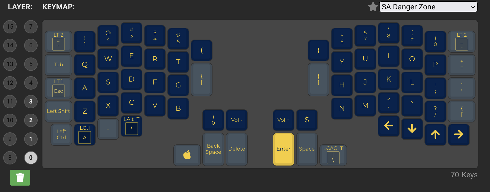

# qmk-profiles
Hyper key is `cmd` + `alt` + `strg`.

Software mapped to [ colemak ](https://colemak.com/). Second layer has arrow keys on `jkl;` (`neio` in colemak) for vim.

Current setup looks like this:

